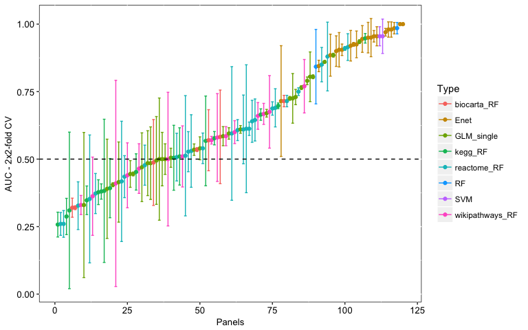
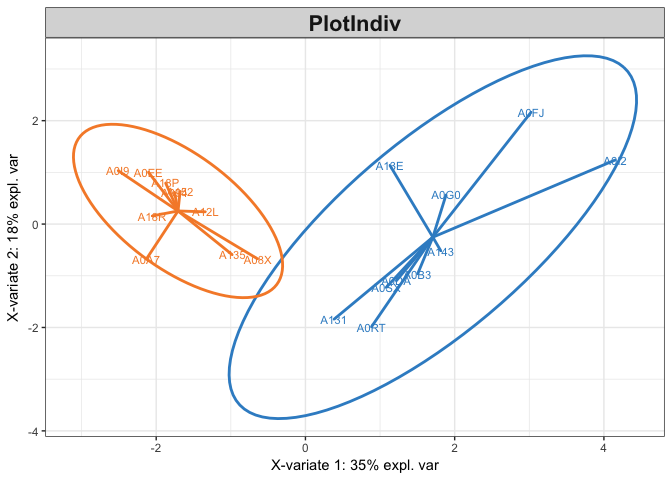
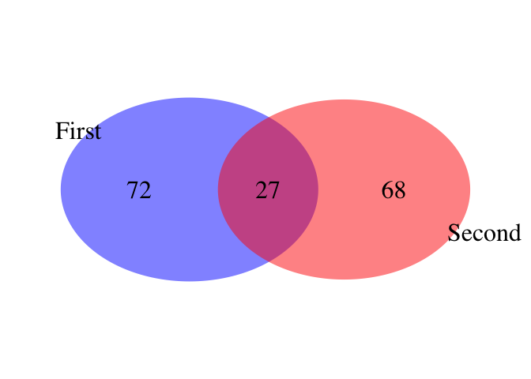

# How to use the functions in this package
Amrit Singh  
December 3, 2016  


```r
library(amritr)
library(mixOmics)
```

#biomarker pipeline()
## y~X, y = binary response, X = nxp dataset
### Description of classification algorithms
  * Enet panels (alpha = 0-0.9, step = 0.1) with and without a p-value filter (topranked = # of top ranked significant features to use)
  * random forest panels with and without a p-value filter (topranked = # of top ranked features to use)
  * support vector machine panels with and without a p-value filter (topranked = # of top ranked features to use)
  * single (p) biomarkers (based on a glm model)
  * pathway biomarkers based on geneset from BioCarta_2016, KEGG_2016, Reactome_2016, and WikiPathways_2016 from Enrichr (each panel is a geneset from a given database)

### Inputs and outputs
  * Input:
          + X = nxp dataset
          + y = n-vector of class labels
          + topranked = 30 (number of significant features to input into classifier)
          + validation = "Mfold" or "loo"
          + M = 2 - # of folds in the cross-validation scheme
          + iter - # of times to repeat cross-validation
          + threads - # of cores, each running a cross-validation scheme
          + pathways - list of lists each for a different database; each element is a genset consisting of gene symbols
  * Output:
          + a dataframe with columns, Mean and SD of CV-AUC, Panel_label, Genes (within panels), Type of Panel (Enet, RF, SVM, GLM, Pathways(biocarta, kegg, reactome, wikipathways))


```r
data("pathways"); data("breast.TCGA")

Y = breast.TCGA$data.train$subtype
names(Y) <- rownames(breast.TCGA$data.train$mrna)

Y = c(Y[Y == "Basal"][1:10], Y[Y == "Her2"][1:10])
Y[Y == 1] <- "Basal"
Y[Y == 2] <- "Her2"
Y <- factor(Y)
set.seed(123)
X = breast.TCGA$data.train$mrna[names(Y), sample(1:200, 30)]

## run biomarker pipeline for a binary response
allPanels <- biomarkerPipeline(X = X, Y = Y, topranked = 30, validation = "Mfold", M = 2, 
             iter = 2, threads = 2, progressBar = TRUE, pathways = pathways)
allPanels %>% arrange(desc(Mean)) %>% head
```

```
##    Mean         SD            Panel
## 1 1.000 0.00000000    Enet_0.7_none
## 2 1.000 0.00000000    Enet_0.8_none
## 3 0.985 0.02121320    Enet_0.9_none
## 4 0.980 0.02828427    Enet_0.5_none
## 5 0.980 0.02828427 Enet_0.6_p.value
## 6 0.980 0.02828427       RF_p.value
##                                                                                                        Genes
## 1                                       TANC2_ETS2_TTC39A_MEX3A_APOD_ALCAM_CDK18_ICA1_ZKSCAN1_C1orf162_FMNL2
## 2                                                 TANC2_ETS2_TTC39A_MEX3A_ALCAM_CDK18_ZKSCAN1_C1orf162_FMNL2
## 3                                                 TANC2_ETS2_TTC39A_MEX3A_ALCAM_CDK18_ZKSCAN1_C1orf162_FMNL2
## 4 TANC2_ZNRF3_ETS2_TTC39A_MEX3A_APOD_AMPD3_ALCAM_HTRA1_CDK18_RHOU_SGPP1_ICA1_ZKSCAN1_C1orf162_FMNL2_EIF4EBP3
## 5            CDK18_ALCAM_MEX3A_TANC2_TTC39A_FMNL2_APOD_SGPP1_ZKSCAN1_HTRA1_ETS2_C1orf162_ICA1_EIF4EBP3_AMPD3
## 6                                               CDK18_ALCAM_MEX3A_TANC2_TTC39A_MEGF9_FMNL2_APOD_MAP3K1_SGPP1
##   Type
## 1 Enet
## 2 Enet
## 3 Enet
## 4 Enet
## 5 Enet
## 6   RF
```

### Plot AUC (Mean +/- SD) of all panels


```r
allPanels %>% arrange(Mean) %>% mutate(Panel = 1:nrow(.)) %>% 
  ggplot(aes(x = Panel, y = Mean, color = Type)) + geom_point() +
  geom_errorbar(aes(ymin = Mean-SD, ymax = Mean+SD)) +
  customTheme(sizeStripFont = 10, xAngle = 0, hjust = 0.5, vjust = 0.5,
    xSize = 10, ySize = 10, xAxisSize = 10, yAxisSize = 10) +
  ylab("AUC - 2x2-fold CV") + xlab("Panels") +
  geom_hline(yintercept = 0.5, linetype = "dashed")
```



### Plot best performing panel


```r
(topPanel <- allPanels %>% arrange(desc(Mean)) %>% head %>% slice(1))
```

```
##   Mean SD         Panel
## 1    1  0 Enet_0.7_none
##                                                                  Genes
## 1 TANC2_ETS2_TTC39A_MEX3A_APOD_ALCAM_CDK18_ICA1_ZKSCAN1_C1orf162_FMNL2
##   Type
## 1 Enet
```

```r
pcaX <- plsda(X[, unlist(strsplit(topPanel$Genes, "_"))], Y)
plotIndiv(pcaX, group = Y, ellipse = TRUE, star = TRUE)
```

<!-- -->

# Integrative methods (Concatenation, Ensemble and DIABLO)
## Concatenation-Enet biomarker panel
### Description of algorithm
  * all X datasets are combined column-wise and a single-dataset classifer is applied (Enet)


```r
X.train <- breast.TCGA$data.train[c("mrna", "mirna")]
Y.train <- breast.TCGA$data.train$subtype
X.test <- breast.TCGA$data.test[c("mrna", "mirna")]
Y.test <- breast.TCGA$data.test$subtype
M = 2; iter = 2; cpus = 2;

## Build panel and estimate test performance
result <- enet(X = do.call(cbind, X.train), Y = Y.train, alpha=1, family="multinomial", lambda = NULL, 
               X.test = do.call(cbind, X.test), Y.test = Y.test, filter = "none", topranked = 50)
lapply(X.train, function(i){
  intersect(colnames(i), result$enet.panel)
})
```

```
## $mrna
##  [1] "NDRG2"    "FAM63A"   "GMDS"     "ASPM"     "MED13L"   "SNORA8"  
##  [7] "ZNF552"   "STAT5A"   "FUT8"     "AKAP12"   "TANC2"    "SLC19A2" 
## [13] "C4orf34"  "LRIG1"    "DEPDC6"   "STC2"     "DTWD2"    "CD302"   
## [19] "LAPTM4B"  "HN1"      "ALCAM"    "PLCD3"    "OGFRL1"   "DBP"     
## [25] "E2F1"     "TOB1"     "SHROOM3"  "CCNA2"    "TIGD5"    "NCAPG2"  
## [31] "IFITM2"   "SLC5A6"   "PREX1"    "CDK18"    "YPEL2"    "CBR1"    
## [37] "MEX3A"    "C1QB"     "ZNF37B"   "MEGF9"    "TRIM45"   "ELP2"    
## [43] "KRT8"     "TP53INP2"
## 
## $mirna
##  [1] "hsa-mir-106a"   "hsa-mir-1307"   "hsa-mir-144"    "hsa-mir-148a"  
##  [5] "hsa-mir-181a-2" "hsa-mir-20a"    "hsa-mir-340"    "hsa-mir-374a"  
##  [9] "hsa-mir-375"    "hsa-mir-451"    "hsa-mir-455"    "hsa-mir-590"   
## [13] "hsa-mir-92a-2"
```

```r
## Estimate panel performance using cross-validation
cv <- perf.enet(result, validation = "Mfold", M = M, iter = iter, threads = cpus, progressBar = FALSE)
concat_enetErrTrain_tuneConcat <- filter(cv$perf, ErrName == "BER")[-1]
concat_enetErrTest_tuneConcat <- c(result$perfTest["BER"], NA)
names(concat_enetErrTest_tuneConcat) <- names(concat_enetErrTrain_tuneConcat)

## Concateantion panel error rate
rbind(concat_enetErrTrain_tuneConcat, concat_enetErrTest_tuneConcat) %>% 
  mutate(Set = c("Train", "Test"))
```

```
## # A tibble: 2 × 3
##         Mean         SD   Set
##        <dbl>      <dbl> <chr>
## 1 0.07128217 0.02433846 Train
## 2 0.06507937         NA  Test
```

## Ensemble classifier
### Description of classifier


```r
## Build panel and estimate test performance
ensembleMod <- ensembleEnet(X.train, Y.train, alpha=1, lambda=NULL, X.test, Y.test)
ensembleResult <- ensembleMod$result %>% zip_nPure()
ensemblePanel <- ensembleResult$enet.panel
ensemblePanel
```

```
## $mrna
##  [1] "NDRG2"    "ASPM"     "MED13L"   "SNORA8"   "ZNF552"   "STAT5A"  
##  [7] "FUT8"     "AKAP12"   "SLCO3A1"  "SLC19A2"  "TBC1D4"   "STC2"    
## [13] "DTWD2"    "CD302"    "LAPTM4B"  "CSRP2"    "ALCAM"    "PLCD3"   
## [19] "OGFRL1"   "DBP"      "E2F1"     "TOB1"     "SHROOM3"  "CCNA2"   
## [25] "TIGD5"    "NCAPG2"   "IFITM2"   "SLC5A6"   "PREX1"    "CDK18"   
## [31] "YPEL2"    "CBR1"     "MEX3A"    "C1QB"     "PLCD4"    "ZNF37B"  
## [37] "MEGF9"    "FAM13A"   "TRIM45"   "ELP2"     "KRT8"     "TP53INP2"
## 
## $mirna
##  [1] "hsa-let-7b"     "hsa-let-7c"     "hsa-mir-101-1"  "hsa-mir-101-2" 
##  [5] "hsa-mir-106a"   "hsa-mir-107"    "hsa-mir-10a"    "hsa-mir-125a"  
##  [9] "hsa-mir-128-2"  "hsa-mir-1301"   "hsa-mir-1307"   "hsa-mir-130b"  
## [13] "hsa-mir-134"    "hsa-mir-139"    "hsa-mir-148a"   "hsa-mir-148b"  
## [17] "hsa-mir-149"    "hsa-mir-155"    "hsa-mir-181a-2" "hsa-mir-181b-1"
## [21] "hsa-mir-181c"   "hsa-mir-181d"   "hsa-mir-183"    "hsa-mir-185"   
## [25] "hsa-mir-191"    "hsa-mir-193a"   "hsa-mir-196b"   "hsa-mir-200b"  
## [29] "hsa-mir-203"    "hsa-mir-20a"    "hsa-mir-21"     "hsa-mir-25"    
## [33] "hsa-mir-26b"    "hsa-mir-30a"    "hsa-mir-30c-2"  "hsa-mir-328"   
## [37] "hsa-mir-331"    "hsa-mir-340"    "hsa-mir-342"    "hsa-mir-3613"  
## [41] "hsa-mir-375"    "hsa-mir-378"    "hsa-mir-423"    "hsa-mir-424"   
## [45] "hsa-mir-451"    "hsa-mir-455"    "hsa-mir-497"    "hsa-mir-505"   
## [49] "hsa-mir-574"    "hsa-mir-584"    "hsa-mir-590"    "hsa-mir-625"   
## [53] "hsa-mir-664"    "hsa-mir-7-1"    "hsa-mir-874"    "hsa-mir-9-1"   
## [57] "hsa-mir-93"
```

```r
## Estimate panel performance using cross-validation
ensembleTrain <- perfEnsemble(object=ensembleMod, validation = "Mfold", M = M, iter = iter, threads = cpus, progressBar = TRUE)
ensemble_enetLength <- lapply(ensemblePanel, length)
ensemble_enetErrTrain_tuneEnsemble <- filter(ensembleTrain$perf, ErrName == "BER")[-1]
ensemble_enetErrTest_tuneEnsemble <- c(ensembleMod$error["BER"], NA)
names(ensemble_enetErrTest_tuneEnsemble) <- names(ensemble_enetErrTrain_tuneEnsemble)

## Ensemble panel error rate
rbind(ensemble_enetErrTrain_tuneEnsemble, ensemble_enetErrTest_tuneEnsemble) %>% 
  mutate(Set = c("Train", "Test"))
```

```
## # A tibble: 2 × 3
##        Mean        SD   Set
##       <dbl>     <dbl> <chr>
## 1 0.2440741 0.0518545 Train
## 2 0.1222222        NA  Test
```

## DIABLO classifier
### description of classifier

#### tune DIABLO classifier


```r
design <- setDesign(X.train, corCutOff = 0.6, plotMat = FALSE)
ncomp <- nlevels(Y.train) - 1
list.keepX <- lapply(ensemble_enetLength, function(i){
  rep(round(i/ncomp, 0), ncomp)
})
TCGA.block.splsda = block.splsda(X = X.train, Y = Y.train, 
  ncomp = ncomp, keepX = list.keepX, design = design,
  scheme = "centroid")

diabloFeat <- lapply(TCGA.block.splsda$loadings[-(length(X.train)+1)], function(x)
  unique(as.character(as.matrix(apply(x, 2, function(i) names(i)[which(i != 0)])))))
diabloFeat
```

```
## $mrna
##  [1] "ZEB1"    "HTRA1"   "ASPM"    "KDM4B"   "ZNF552"  "FUT8"    "EPHB3"  
##  [8] "C4orf34" "LRIG1"   "DTWD2"   "SLC43A3" "TTC39A"  "ALCAM"   "NTN4"   
## [15] "E2F1"    "CCNA2"   "NCAPG2"  "SNED1"   "PREX1"   "MEX3A"   "SEMA3C" 
## [22] "TAGLN"   "ARL4C"   "SEMA5A"  "COL15A1" "SDC1"    "TCF4"    "COL6A1" 
## [29] "APBB1IP" "IL1R1"   "EMP3"    "CNN2"    "CCDC80"  "CXCL12"  "POSTN"  
## [36] "IL4R"    "CTSK"    "MRVI1"   "CERCAM" 
## 
## $mirna
##  [1] "hsa-let-7d"     "hsa-mir-106a"   "hsa-mir-106b"   "hsa-mir-1301"  
##  [5] "hsa-mir-1307"   "hsa-mir-130b"   "hsa-mir-146a"   "hsa-mir-15b"   
##  [9] "hsa-mir-16-2"   "hsa-mir-17"     "hsa-mir-186"    "hsa-mir-197"   
## [13] "hsa-mir-19b-2"  "hsa-mir-20a"    "hsa-mir-25"     "hsa-mir-455"   
## [17] "hsa-mir-501"    "hsa-mir-505"    "hsa-mir-532"    "hsa-mir-576"   
## [21] "hsa-mir-590"    "hsa-mir-660"    "hsa-mir-9-1"    "hsa-mir-9-2"   
## [25] "hsa-mir-92a-1"  "hsa-mir-92a-2"  "hsa-mir-93"     "hsa-mir-98"    
## [29] "hsa-let-7c"     "hsa-mir-125b-1" "hsa-mir-127"    "hsa-mir-134"   
## [33] "hsa-mir-141"    "hsa-mir-152"    "hsa-mir-181a-1" "hsa-mir-199a-1"
## [37] "hsa-mir-199a-2" "hsa-mir-199b"   "hsa-mir-200b"   "hsa-mir-200c"  
## [41] "hsa-mir-21"     "hsa-mir-214"    "hsa-mir-22"     "hsa-mir-2355"  
## [45] "hsa-mir-23b"    "hsa-mir-27b"    "hsa-mir-30a"    "hsa-mir-30c-2" 
## [49] "hsa-mir-337"    "hsa-mir-379"    "hsa-mir-381"    "hsa-mir-409"   
## [53] "hsa-mir-539"    "hsa-mir-542"    "hsa-mir-708"    "hsa-mir-99a"
```

```r
## training error
cv <- perf(TCGA.block.splsda, validation = "Mfold", folds = M, cpus = cpus, nrepeat = iter)
err <- extractErr(cv)
err$Comp <- factor(err$Comp, levels = paste("comp", 1:ncomp, sep = "."))
diablo_enetErrTrain <- err %>% filter(Type == "centroids.dist", Class == "Overall.BER", 
  EnsembleMode == "wMajVote", Dataset == "DIABLO", Comp == paste("comp", ncomp, sep = "."))
diablo_enetErrTrain <- diablo_enetErrTrain[c("meanErr", "sdErr")]

## test error
diabloTest <- predict(TCGA.block.splsda, X.test, method = "all")
diabloTestConsensus <- lapply(diabloTest$WeightedVote, function(i){
  predY <- apply(i, 2, function(z){
    temp <- table(factor(z, levels = levels(Y.test)), Y.test)
    diag(temp) <- 0
    error = c(colSums(temp)/summary(Y.test), sum(temp)/length(Y.test), mean(colSums(temp)/summary(Y.test)))
    names(error) <- c(names(error)[1:nlevels(Y.test)], "ER", "BER")
    error
  })
})
diablo_enetErrTest <- c(diabloTestConsensus$centroids.dist["BER", paste("comp", ncomp, sep = "")], NA)
names(diablo_enetErrTest) <- names(diablo_enetErrTrain)
## DIABLO panel error rate
rbind(diablo_enetErrTrain, diablo_enetErrTest) %>% 
  mutate(Set = c("Train", "Test"))
```

```
## # A tibble: 2 × 3
##     meanErr      sdErr   Set
##       <dbl>      <dbl> <chr>
## 1 0.2311111 0.03456966 Train
## 2 0.1587302         NA  Test
```

## overlap between panels
## Ensemble and DIABLO


```r
datList = list(ensemble = as.character(unlist(ensemblePanel)), diablo=as.character(unlist(diabloFeat)))
venndiagram(datList = datList, circleNames = c("Ensemble", "DIABLO"))
```

<!-- -->

```
## $vennPlot
## (polygon[GRID.polygon.11], polygon[GRID.polygon.12], polygon[GRID.polygon.13], polygon[GRID.polygon.14], text[GRID.text.15], text[GRID.text.16], text[GRID.text.17], text[GRID.text.18], text[GRID.text.19]) 
## 
## $elements
## $elements$ensemble
##  [1] "NDRG2"          "MED13L"         "SNORA8"         "STAT5A"        
##  [5] "AKAP12"         "SLCO3A1"        "SLC19A2"        "TBC1D4"        
##  [9] "STC2"           "CD302"          "LAPTM4B"        "CSRP2"         
## [13] "PLCD3"          "OGFRL1"         "DBP"            "TOB1"          
## [17] "SHROOM3"        "TIGD5"          "IFITM2"         "SLC5A6"        
## [21] "CDK18"          "YPEL2"          "CBR1"           "C1QB"          
## [25] "PLCD4"          "ZNF37B"         "MEGF9"          "FAM13A"        
## [29] "TRIM45"         "ELP2"           "KRT8"           "TP53INP2"      
## [33] "hsa-let-7b"     "hsa-mir-101-1"  "hsa-mir-101-2"  "hsa-mir-107"   
## [37] "hsa-mir-10a"    "hsa-mir-125a"   "hsa-mir-128-2"  "hsa-mir-139"   
## [41] "hsa-mir-148a"   "hsa-mir-148b"   "hsa-mir-149"    "hsa-mir-155"   
## [45] "hsa-mir-181a-2" "hsa-mir-181b-1" "hsa-mir-181c"   "hsa-mir-181d"  
## [49] "hsa-mir-183"    "hsa-mir-185"    "hsa-mir-191"    "hsa-mir-193a"  
## [53] "hsa-mir-196b"   "hsa-mir-203"    "hsa-mir-26b"    "hsa-mir-328"   
## [57] "hsa-mir-331"    "hsa-mir-340"    "hsa-mir-342"    "hsa-mir-3613"  
## [61] "hsa-mir-375"    "hsa-mir-378"    "hsa-mir-423"    "hsa-mir-424"   
## [65] "hsa-mir-451"    "hsa-mir-497"    "hsa-mir-574"    "hsa-mir-584"   
## [69] "hsa-mir-625"    "hsa-mir-664"    "hsa-mir-7-1"    "hsa-mir-874"   
## 
## $elements$diablo
##  [1] "ZEB1"           "HTRA1"          "KDM4B"          "EPHB3"         
##  [5] "C4orf34"        "LRIG1"          "SLC43A3"        "TTC39A"        
##  [9] "NTN4"           "SNED1"          "SEMA3C"         "TAGLN"         
## [13] "ARL4C"          "SEMA5A"         "COL15A1"        "SDC1"          
## [17] "TCF4"           "COL6A1"         "APBB1IP"        "IL1R1"         
## [21] "EMP3"           "CNN2"           "CCDC80"         "CXCL12"        
## [25] "POSTN"          "IL4R"           "CTSK"           "MRVI1"         
## [29] "CERCAM"         "hsa-let-7d"     "hsa-mir-106b"   "hsa-mir-146a"  
## [33] "hsa-mir-15b"    "hsa-mir-16-2"   "hsa-mir-17"     "hsa-mir-186"   
## [37] "hsa-mir-197"    "hsa-mir-19b-2"  "hsa-mir-501"    "hsa-mir-532"   
## [41] "hsa-mir-576"    "hsa-mir-660"    "hsa-mir-9-2"    "hsa-mir-92a-1" 
## [45] "hsa-mir-92a-2"  "hsa-mir-98"     "hsa-mir-125b-1" "hsa-mir-127"   
## [49] "hsa-mir-141"    "hsa-mir-152"    "hsa-mir-181a-1" "hsa-mir-199a-1"
## [53] "hsa-mir-199a-2" "hsa-mir-199b"   "hsa-mir-200c"   "hsa-mir-214"   
## [57] "hsa-mir-22"     "hsa-mir-2355"   "hsa-mir-23b"    "hsa-mir-27b"   
## [61] "hsa-mir-337"    "hsa-mir-379"    "hsa-mir-381"    "hsa-mir-409"   
## [65] "hsa-mir-539"    "hsa-mir-542"    "hsa-mir-708"    "hsa-mir-99a"   
## 
## $elements$ensemblediablo
##  [1] "ASPM"          "ZNF552"        "FUT8"          "DTWD2"        
##  [5] "ALCAM"         "E2F1"          "CCNA2"         "NCAPG2"       
##  [9] "PREX1"         "MEX3A"         "hsa-let-7c"    "hsa-mir-106a" 
## [13] "hsa-mir-1301"  "hsa-mir-1307"  "hsa-mir-130b"  "hsa-mir-134"  
## [17] "hsa-mir-200b"  "hsa-mir-20a"   "hsa-mir-21"    "hsa-mir-25"   
## [21] "hsa-mir-30a"   "hsa-mir-30c-2" "hsa-mir-455"   "hsa-mir-505"  
## [25] "hsa-mir-590"   "hsa-mir-9-1"   "hsa-mir-93"
```


