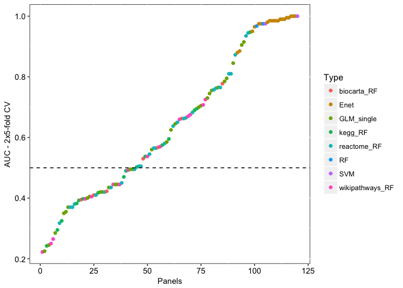

# How to use the functions in this package
Amrit Singh  
December 3, 2016  


## biomarker pipeline (compare Basal vs. Her2)


```r
library(amritr); data("pathways")
library(mixOmics); data("breast.TCGA")

Y = breast.TCGA$data.train$subtype
names(Y) <- rownames(breast.TCGA$data.train$mrna)

Y = c(Y[Y == "Basal"][1:10], Y[Y == "Her2"][1:10])
Y[Y == 1] <- "Basal"
Y[Y == 2] <- "Her2"
Y <- factor(Y)
set.seed(123)
X = breast.TCGA$data.train$mrna[names(Y), sample(1:200, 30)]

## run biomarker pipeline for a binary response
allPanels <- biomarkerPipeline(X = X, Y = Y, topranked = 30, validation = "Mfold", M = 5, iter = 2, threads = 2, progressBar = TRUE, pathways = pathways)

allPanels %>% arrange(Mean) %>% mutate(Panel = 1:nrow(.)) %>% 
  ggplot(aes(x = Panel, y = Mean, color = Type)) + geom_point() +
  customTheme(sizeStripFont = 10, xAngle = 0, hjust = 0.5, vjust = 0.5,
    xSize = 10, ySize = 10, xAxisSize = 10, yAxisSize = 10) +
  ylab("AUC - 2x5-fold CV") + xlab("Panels") +
  geom_hline(yintercept = 0.5, linetype = "dashed")
```

<!-- -->
